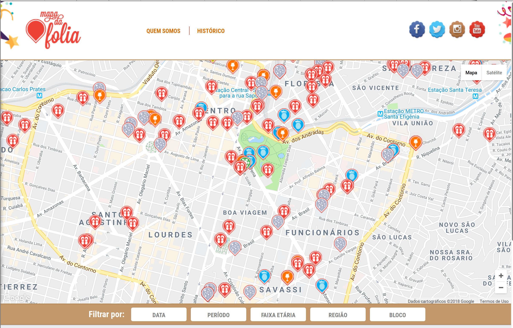
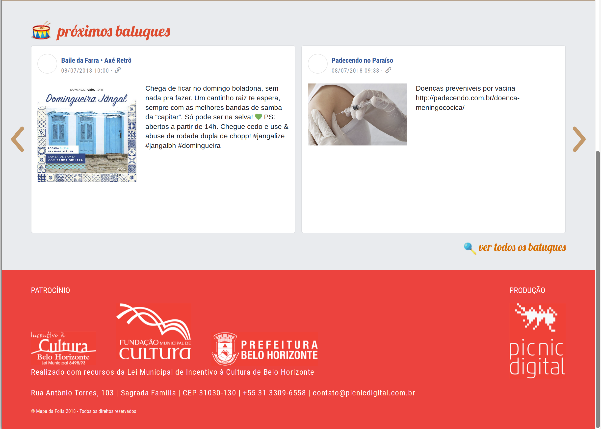

Folia
===

Theme creado para mapadafolia.com.br

Mapa da Folia é uma plataforma transmídia em desenvolvimento. Além da versão
web (que só tem, ativas, 30% das funcionalidades previstas, até o momento),
dispõe de recursos responsivos que permitem uma ótima navegação por tablet e
celular.

# capturas

O projeto marca o lançamento da picnic digital corporeixan, agência de
comunicação e marketing de conteúdo voltada para o desenvolvimento de
soluções digitais para demandas da cultura, com foco especial na
sistematização de dados, na geração de indicadores e no mapeamento de nichos
de mercado, nos mais variados setores. A empresa atua também na criação de
campanhas online, em ações de ativação digital de marca, no desenvolvimento
de plataformas web e aplicativos e na gestão de conteúdo multiplataforma –em
texto, áudio ou vídeo.
